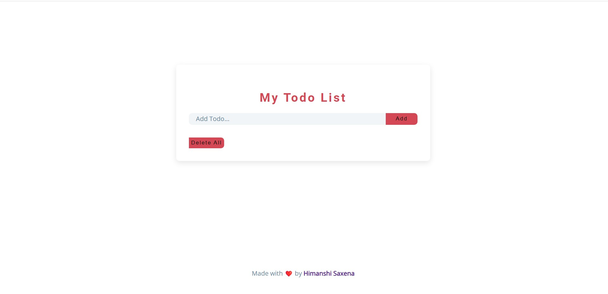

# Image gallery

> A simple

## Table of contents

- [General info](#general-info)
- [Screenshots](#screenshots)
- [Technologies](#technologies)
- [Setup](#setup)
- [Status](#status)
- [Contact](#contact)

## General info

> The objective of the project is to practice separation of concern in
> JavaScript.

## Screenshots



## Technologies

- JavaScript
- HTML5
- CSS3
- VSC code

## Setup

clone the repo and start using the todo list.

## Code Examples

```

task_input.addEventListener('keyup', (e) => {
    if (e.keyCode === 13 && task_input.value.length > 0) {
        addToDo(task_input);
        saveToLocalStorage();
        task_input.value = '';
        showAllTodos();
    }
});

```

## Status

Project is: _in progress_

## Contact

[Himanshi Saxena](https://github.com/himanshisaxena)
